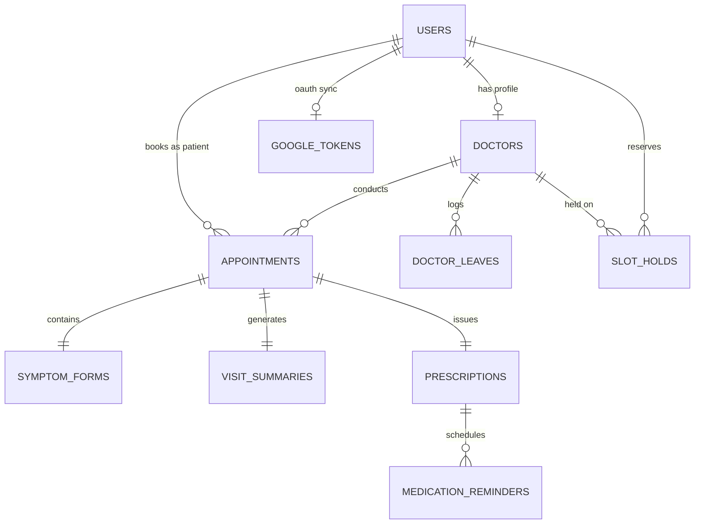

# HealthSync - Healthcare Appointment & Follow-up Manager

An enterprise-grade, full-stack Healthcare Appointment & Follow-up Management web application built with **FastAPI**, **MySQL / SQLAlchemy**, **React (Vite) + Tailwind CSS**, **Groq LLaMA 3.3 70B AI**, **Google Calendar OAuth 2.0**, and **APScheduler**.

Designed with a deep purple luxury showroom aesthetic (`#1a0a3e` obsidian/violet palette) featuring high-contrast readability, glassmorphism, and responsive micro-animations.

---

## 1. Tech Stack & Architecture

- **Frontend:** React 19 (Vite) + Tailwind CSS + Lucide Icons + Axios
- **Backend:** Python 3.11+, FastAPI, Pydantic V2, Uvicorn
- **Database:** MySQL / SQLite (SQLAlchemy 2.0 ORM + Alembic Migrations)
- **Authentication:** JWT-based RBAC (`patient`, `doctor`, `admin`)
- **LLM Engine:** Groq API (**LLaMA 3.3 70B** — `llama-3.3-70b-versatile`) with guaranteed offline/fallback degradation
- **Email Service:** Python native `smtplib` / `fastapi-mail`
- **Calendar Integration:** Google Calendar API v3 with OAuth 2.0
- **Background Scheduler:** APScheduler (medication reminders, failed email retries with exponential backoff, expired hold cleanup)
- **Deployment:** Render (Backend API) + Vercel (Frontend SPA) / Railway

### Architecture Justification: Email Service
> **Why Python `smtplib`/`fastapi-mail` instead of a Node.js microservice?**
> A Python-native asynchronous email worker eliminates the operational complexity, network latency, and memory overhead of maintaining a separate Node.js runtime. Email dispatches are recorded in the database `notifications` audit queue and processed asynchronously without blocking user-facing requests.

---

## 2. Quick Start & Local Run Instructions

### Prerequisites
- **Node.js** v18+ and **npm** v9+
- **Python** 3.10+ (Python 3.11/3.12/3.13 supported)
- **MySQL** 8.0+ (or SQLite fallback for zero-config local testing)

### Step 1: Clone Repository
```bash
git clone https://github.com/<your-username>/Healthcare_Appointment_Manager.git
cd Healthcare_Appointment_Manager
```

### Step 2: Configure Environment
Copy `.env.example` to `.env` in the project root:
```bash
cp .env.example .env
```
*(Optionally populate your `GROQ_API_KEY`, `GOOGLE_CLIENT_ID`, and SMTP credentials)*

### Step 3: Backend Setup
```bash
# Install Python dependencies
pip install -r backend/requirements.txt

# Run database migrations (optional, tables are automatically initialized on startup)
cd backend
alembic upgrade head
cd ..

# Start FastAPI server (Runs at http://localhost:8000)
uvicorn backend.app.main:app --reload --port 8000
```
Interactive Swagger API documentation is available at: **`http://localhost:8000/docs`**

### Step 4: Frontend Setup
In a new terminal window:
```bash
cd frontend

# Install dependencies
npm install

# Start Vite development server (Runs at http://localhost:5173)
npm run dev
```
Open **`http://localhost:5173`** in your browser.

---

## 3. Seeded Accounts & Quick Demo Switcher

The application includes an instant **One-Click Demo Switcher** bar at the top of the interface:

| Role | Email | Password | Pre-seeded Capabilities |
| :--- | :--- | :--- | :--- |
| **Admin** | `admin@healthsync.care` | `AdminPassword123!` | Manage doctors, slot parameters, view platform revenue & audit retry queue |
| **Doctor** | `dr.sarah.mitchell@healthsync.care` | `DoctorPassword123!` | View AI pre-visit triage, write clinical notes, prescribe meds, apply leaves |
| **Doctor** | `dr.marcus.vance@healthsync.care` | `DoctorPassword123!` | Neurology specialist with automated schedule |
| **Patient** | `patient@healthsync.care` | `PatientPassword123!` | Book slots with 10-minute hold lock, submit symptoms, view AI summaries |

---

## 4. Exact Groq LLaMA 3.3 70B Prompts

HealthSync uses Groq's high-speed LLaMA 3.3 70B inference engine with strict fallback handling:

### 1. Pre-Visit Symptom Analysis Prompt
```text
Analyse these symptoms and return: urgency level (Low / Medium / High), chief complaint, and three suggested questions for the doctor. Symptoms: <symptoms>
```
*Output Schema:*
```json
{
  "urgency_level": "Low" | "Medium" | "High",
  "chief_complaint": "Clear concise summary",
  "suggested_questions": [
    "Diagnostic question 1",
    "Diagnostic question 2",
    "Diagnostic question 3"
  ]
}
```

### 2. Post-Visit Clinical Translation Prompt
```text
Convert these clinical notes into a patient-friendly summary with medication schedule and follow-up steps: <notes>
```
*Output Schema:*
```json
{
  "patient_summary": "Accessible, compassionate patient summary",
  "medication_schedule": "Clear timing and dosage instructions",
  "followup_steps": "Warning signs and next appointment steps"
}
```

*Graceful Degradation Guarantee:* If the Groq API key is omitted, invalid, or experiences network timeouts, the application seamlessly logs the exception and returns deterministic fallback content. Booking and clinical workflows are **never** interrupted.

---

## 5. Database Schema (ERD Breakdown)



### Table Breakdown
1. **`users`**: User identities, role enum (`patient`, `doctor`, `admin`), bcrypt password hash.
2. **`doctors`**: Specialization, bio, consultation fee, working hours (`09:00 - 17:00`), slot duration (`30 min`), working days, room number.
3. **`doctor_leaves`**: Recorded leaves with unique constraint `(doctor_id, leave_date)`.
4. **`slot_holds`**: Temporary 10-minute hold token (`hold_token`), expiration timestamp, status (`held`, `converted`, `expired`).
5. **`appointments`**: Confirmed bookings with unique composite constraint `(doctor_id, slot_start)`, Google Meet link, and Google event ID.
6. **`symptom_forms`**: Raw patient symptoms, duration, pain scale 1–10 slider.
7. **`visit_summaries`**: Doctor clinical notes, AI urgency score, AI chief complaint, 3 diagnostic questions, AI patient summary, and medication schedule.
8. **`prescriptions`**: Structured medication items (`name`, `dosage`, `frequency`, `duration_days`, `instructions`), advice, follow-up date.
9. **`medication_reminders`**: Background reminder tracks triggered by APScheduler.
10. **`notifications`**: Full audit log for all emails (`booking_confirmation`, `reminder`, `cancellation`, `doctor_leave_rebook`, `medication_reminder`) with status (`PENDING`, `SENT`, `FAILED`) and retry counters.
11. **`google_tokens`**: Google OAuth 2.0 access & refresh tokens.

---

## 6. Google Calendar OAuth 2.0 Setup

1. Open the [Google Cloud Console](https://console.cloud.google.com/).
2. Create a new Project (e.g., `HealthSync-Portal`).
3. Enable the **Google Calendar API**.
4. Configure the **OAuth Consent Screen** (User Type: External, Scopes: `https://www.googleapis.com/auth/calendar`).
5. Create **OAuth 2.0 Client ID** (Application type: Web application):
   - **Authorized JavaScript origins:** `http://localhost:5173`, `http://localhost:8000`
   - **Authorized redirect URIs:** `http://localhost:8000/api/v1/calendar/oauth2callback`
6. Copy the Client ID & Secret to `.env`:
   ```env
   GOOGLE_CLIENT_ID=your_client_id.apps.googleusercontent.com
   GOOGLE_CLIENT_SECRET=your_client_secret
   GOOGLE_REDIRECT_URI=http://localhost:8000/api/v1/calendar/oauth2callback
   ```
*(Note: If omitted, HealthSync automatically runs in simulated calendar mode with mock Google Meet links).*

---

## 7. Key API Endpoints Reference

### Authentication
- `POST /api/v1/auth/register` — Patient registration
- `POST /api/v1/auth/login` — JWT authentication
- `GET /api/v1/auth/me` — Current user profile

### Doctors & Availability
- `GET /api/v1/doctors` — List doctors (search by name, filter by specialty)
- `GET /api/v1/doctors/{id}/slots?target_date=YYYY-MM-DD` — Real-time available/held slots
- `POST /api/v1/doctors/{id}/holds` — Acquire 10-minute temporary slot hold

### Appointments & Visits
- `POST /api/v1/appointments` — Concurrency-safe booking with symptom intake & AI triage
- `GET /api/v1/appointments/my` — User appointments list
- `POST /api/v1/appointments/{id}/cancel` — Cancel appointment & remove calendar event
- `POST /api/v1/appointments/{id}/reschedule` — Reschedule to a new slot
- `POST /api/v1/visits/{id}/notes` — Submit clinical notes & generate LLaMA 3.3 summary
- `GET /api/v1/visits/prescriptions/my` — Patient prescriptions & reminders

### Admin & Staff Management
- `POST /api/v1/admin/doctors` — Provision new doctor profile
- `PUT /api/v1/admin/doctors/{id}` — Update doctor schedule and parameters
- `POST /api/v1/admin/doctors/{id}/leaves` — Mark leave with automated patient rebooking triggers
- `GET /api/v1/admin/analytics` — Platform metrics & revenue
- `GET /api/v1/notifications/audit` — Notification failure & delivery log
- `POST /api/v1/notifications/retry/{id}` — Manual notification retry

---

## 8. Automated Testing & Verification

Run the full automated test suite containing unit, integration, and simultaneous concurrency tests:
```bash
cd backend
python -m pytest tests -v
```

### Verified Test Cases:
1. `test_auth.py`: Patient registration, role-based access control, and JWT token issuance.
2. `test_concurrency.py`: Simulates 5 simultaneous multi-threaded requests attempting to book the exact same slot. Verifies **exactly 1 succeeds** and all 4 duplicate requests fail with **409 Conflict**.
3. `test_groq_fallback.py`: Validates graceful degradation of pre-visit and post-visit triage during Groq API outages.
4. `test_leaves.py`: Validates atomic appointment cancellation, priority rebooking token generation, and patient notification queueing when a doctor marks leave.

---

## 9. System Design Write-Up

A comprehensive system design document detailing:
- Concurrency control & double-booking prevention
- 10-minute temporary slot hold mechanics
- Doctor leave conflict resolution & priority rebooking
- Notification failure retry strategy with exponential backoff

Read the full document at: **[`docs/SYSTEM_DESIGN.md`](docs/SYSTEM_DESIGN.md)** (654 words).

---

## 10. Production Deployment Guide

### Deploying Backend to Render
1. Push your repository to GitHub (`main` branch).
2. On [Render](https://render.com), create a new **Blueprint Instance** pointing to `render.yaml`.
3. Set environment variables in the Render dashboard:
   - `DATABASE_URL` (MySQL or PostgreSQL connection string)
   - `GROQ_API_KEY`
   - `FRONTEND_URL` (e.g., `https://healthsync-portal.vercel.app`)

### Deploying Frontend to Vercel
1. On [Vercel](https://vercel.com), import the `frontend/` directory.
2. Build Settings:
   - **Framework Preset:** Vite
   - **Build Command:** `npm run build`
   - **Output Directory:** `dist`
3. Set Environment Variable:
   - `VITE_API_BASE_URL` (e.g., `https://healthsync-backend.onrender.com/api/v1`)
4. Deploy. The `vercel.json` file ensures single-page application routing works out of the box.

---

## 11. License
Licensed under the [MIT License](LICENSE). Built for high-trust clinical workflows.
